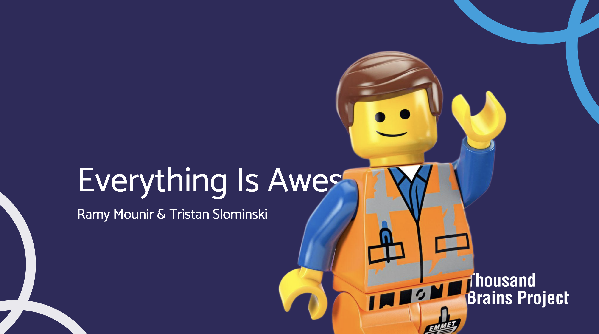

# Everything Is Awesome May 2025 Robot Hackathon repository

> [!NOTE]
>
> This is a fork of the main Monty project used in the May 2025 Hackathon. For the up-to-date Monty project, please see the main repository: https://github.com/thousandbrainsproject/tbp.monty

This is our code for the May 2025 Robot Hackathon repository. We took the fork approach, so all of the Monty code at the time is included in this repository, with some infrastructure and documentation deleted.

## Project Overview

We built a LEGO robot that could orbit around an object, learn the object, and later, recognize the object.

https://github.com/user-attachments/assets/14b6bd9c-69ce-41f6-8099-0c0474a63a80

# Getting Started

> [!WARNING]
> This project is not reproducible.

While this project is not reproducible, it can be used as an example of how to connect Monty to a real-world robot.

## Parts List

This project uses a combination of Raspberry Pi hardware, LEGO Technic parts, RGB and depth sensors to create a fully functional learning robot.

- **Raspberry Pi 4 Model B (x1)** and **Raspberry Pi 5 (x1)**  
  Raspberry Pi 4 is used to control the actuators as well as interface with the Depth Time-of-flight sensor, whereas the Raspberry Pi 5 is used to connect to RGB camera sensor.

> [!NOTE]
> Don't forget the Raspberry Pi accessories (e.g., Micro SD cards, power supplies).

- **Camera Module (x1)**  
  Raspberry Pi Camera Module 3 for RGB image capture.

- **Arducam Time-of-Flight (ToF) Depth Camera (x1)**  
  Provides high-resolution depth measurements.

- **Raspberry Pi Build HAT (x1)**  
  A LEGO-compatible HAT used to interface the Raspberry Pi with LEGO Technic motors and sensors.

> [!NOTE]
> Don't forget the dedicated Build HAT power supply

> [!WARNING]
> The Build HAT only works with RPI4


- **Flexible Flat Cables (FPC)**  
  Connector cables for the RGB and Depth cameras. These usually come with the cameras but longer cables may be
  needed depending on the robot design.

> [!WARNING]
> RPI4 and RPI5 have different DISP/CAM connectors (22-pin vs. 15-pin).

- **LEGO Technic Pieces**  
  We used LEGO Technic parts for building the robot frame, rotating platform, and joints.

- **LEGO Technic Medium Angular Motors (x2)**  
  Motors with built-in absolute encoders for precise angular control. Used to actuate the robot platform and arm.

- **[OPTIONAL] Router with Wireless Access Point (x1)**  
  Provides a dedicated local network for static IP assignment and reliable low-latency communication.

> [!TIP]
> If you do not have physical access to the main router, or access to the router interface,
> it would be useful to use a WIFI extender with an output ethernet port that connects to the
> dedicated router. This ensures that you have access to the internet while on the Robot LAN.

---

## Robot

TODO

## Networking

TODO

## Code changes

The following files were changed after forking from Monty:

```
README.md
benchmarks/configs/my_experiments.py
benchmarks/configs/names.py
pyproject.toml
src/tbp/monty/frameworks/actions/action_samplers.py
src/tbp/monty/frameworks/environment_utils/transforms.py
src/tbp/monty/frameworks/environments/embodied_data.py
src/tbp/monty/frameworks/environments/everything_is_awesome.py
src/tbp/monty/frameworks/experiments/everything_is_awesome.py
src/tbp/monty/frameworks/experiments/monty_experiment.py
src/tbp/monty/frameworks/experiments/object_recognition_experiments.py
src/tbp/monty/frameworks/measure.py
src/tbp/monty/frameworks/models/monty_base.py
src/tbp/monty/frameworks/models/object_model.py
src/tbp/monty/frameworks/utils/everything_is_awesome_visualizations.py
```

To see specific changes, run:
```
$ git diff 1c7b7b166d1ec80e66b641d9e5f8c94d18ffe9f7 8e4328766532ed91dfdc62139a06720a26eaf953
```

First, note the configurations for the training and evaluation experiments in `benchmarks/config/my_experiments.py`: `everything_is_awesome_train` and `everything_is_awesome_eval`.

Next, `pyproject.toml` declares optional dependencies for the project, to be installed after Monty with `pip install -e '.[everything_is_awesome]'`.

We needed to provide our own Actions for Monty to tell the robot how to behave. This required some refactoring of at-the-time implementation of Actions that was not flexible enough to accommodate plugging in a new action.

We parametrized and slightly refactored the `DepthTo3DLocations` transform in `src/tbp/monty/frameworks/environment_utils/transforms.py`.

The bulk of the new implementation is in `src/tbp/monty/frameworks/environments/everything_is_awesome.py` and `src/tbp/monty/frameworks/experiments/everything_is_awesome.py`.

## Monty Installation

The environment for this project is managed with [conda](https://www.anaconda.com/download/success).

To create the environment, run:

### ARM64 (Apple Silicon) (zsh shell)
```
conda env create -f environment.yml --subdir=osx-64
conda init zsh
conda activate paper # TODO: Update to your paper's name
conda config --env --set subdir osx-64
```

### ARM64 (Apple Silicon) (bash shell)
```
conda env create -f environment.yml --subdir=osx-64
conda init
conda activate paper # TODO: Update to your paper's name
conda config --env --set subdir osx-64
```

### Intel (zsh shell)
```
conda env create -f environment.yml
conda init zsh
conda activate paper # TODO: Update to your paper's name
```

### Intel (bash shell)
```
conda env create -f environment.yml
conda init
conda activate paper # TODO: Update to your paper's name
```

# License

The MIT License. See the [LICENSE](LICENSE) for details.
