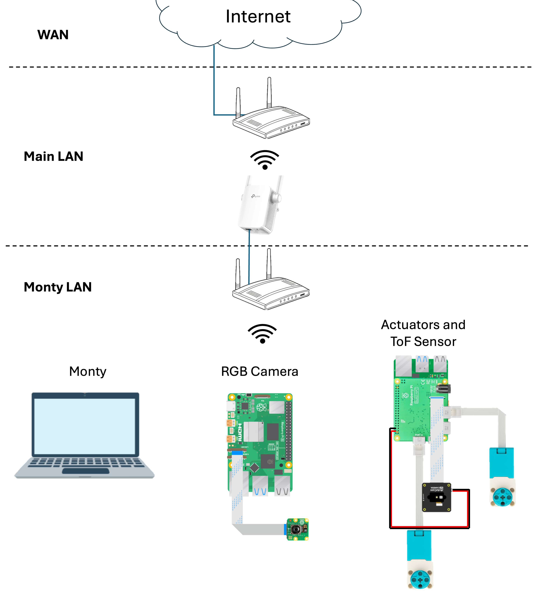

# Everything Is Awesome May 2025 Robot Hackathon repository

> [!NOTE]
>
> This is a fork of the main Monty project used in the May 2025 Hackathon. For the up-to-date Monty project, please see the main repository: https://github.com/thousandbrainsproject/tbp.monty

This is our code for the May 2025 Robot Hackathon repository. We took the fork approach, so all of the Monty code at the time is included in this repository, with some infrastructure and documentation deleted.

## Project Overview

We built a LEGO robot that could orbit around an object, learn the object, and later, recognize the object.

https://github.com/user-attachments/assets/14b6bd9c-69ce-41f6-8099-0c0474a63a80

# Getting Started

> [!WARNING]
> This project is not reproducible.

While this project is not reproducible, it can be used as an example of how to connect Monty to a real-world robot.

## Parts List

This project uses a combination of Raspberry Pi hardware, LEGO Technic parts, RGB and depth sensors to create a fully functional learning robot.

- **Raspberry Pi 4 Model B (x1)** and **Raspberry Pi 5 (x1)**  
  Raspberry Pi 4 is used to control the actuators as well as interface with the Depth Time-of-flight sensor, whereas the Raspberry Pi 5 is used to connect to RGB camera sensor.

> [!NOTE]
> Don't forget the Raspberry Pi accessories (e.g., Micro SD cards, power supplies).

- **Camera Module (x1)**  
  Raspberry Pi Camera Module 3 for RGB image capture.

- **Arducam Time-of-Flight (ToF) Depth Camera (x1)**  
  Provides high-resolution depth measurements.

- **Raspberry Pi Build HAT (x1)**  
  A LEGO-compatible HAT used to interface the Raspberry Pi with LEGO Technic motors and sensors.

> [!NOTE]
> Don't forget the dedicated Build HAT power supply

> [!WARNING]
> The Build HAT only works with RPI4


- **Flexible Flat Cables (FPC)**  
  Connector cables for the RGB and Depth cameras. These usually come with the cameras but longer cables may be
  needed depending on the robot design.

> [!WARNING]
> RPI4 and RPI5 have different DISP/CAM connectors (22-pin vs. 15-pin).

- **LEGO Technic Pieces**  
  We used LEGO Technic parts for building the robot frame, rotating platform, and joints.

- **LEGO Technic Medium Angular Motors (x2)**  
  Motors with built-in absolute encoders for precise angular control. Used to actuate the robot platform and arm.

- **[OPTIONAL] Router with Wireless Access Point (x1)**  
  Provides a dedicated local network for static IP assignment and reliable low-latency communication.

---

## Networking

To enable seamless communication between Monty and the Raspberry Pi modules controlling the robot, we created a dedicated local network (Monty LAN). This setup ensures low-latency, reliable connections between devices, while also optionally preserving internet access.

#### LAN Setup

The Monty LAN consists of:
* A dedicated router or access point that provides IP management and wireless connectivity to all Monty nodes.
* Two Raspberry Pi nodes:
    * One connected to the RGB camera (Raspberry Pi 5).
    * One connected to the actuators and Time-of-Flight (ToF) sensor (Raspberry Pi 4).
* A computer running the Monty codebase, connected to the same network.

If you have physical or administrative access to the main router, you can plug the dedicated router directly into it via Ethernet to provide internet to the Monty LAN.

> [!TIP]
> If physical access to the main router is not possible, use a Wi-Fi extender with an Ethernet
> output port to bridge the Monty router to the internet. This ensures that you have access to
> the internet while on the Robot LAN.

#### Static IP Reservation

To simplify remote access and avoid repeated lookups of dynamic IPs, we recommend setting static IP reservations for the Raspberry Pis in the DHCP settings of your Monty router. This allows you to consistently SSH into each Pi using known addresses, for example:

```bash
ssh pi@192.168.0.101  # RGB camera
ssh pi@192.168.0.102  # Actuators and ToF sensor
```


#### Network design

The overall Network design and nodes are shown in the figure below.




## Robot


#### Sensors

We use the official Raspberry Pi Camera Module 3 as the RGB sensor of the Raspberry Pi 5.
For full setup instructions including OS flashing, environment setup, and camera server configuration, see the [Sensor Pi Setup Guide](scripts/servers/sensors/README.md).

> [!WARNING]
> While the Raspberry Pi 5 supports multiple camera inputs, running both RGB and Depth cameras on
> the same Pi is currently not possible due to conflicting kernel drivers. We moved the depth
> sensor to the Actuator Pi as a workaround.


#### Actuators

The actuators are driven by a Raspberry Pi 4 using the Raspberry Pi Build HAT, which interfaces directly with
LEGO Technic Angular Motors. This allows for precise motor control. The same Raspberry Pi also hosts
the ArduCam Time-of-Flight (ToF) depth camera, used to obtain depths measurements to the objects.

For full setup instructions including OS flashing, Python environment setup, server configuration, see the [Actuator Pi Setup Guide](scripts/servers/actuators/README.md).

#### Robot Lego Design

In order to simplify calculations, when looking at the robot setup from above, the robot operates on the ZX unit circle. The object is placed at the origin x,y,z coordinates of (0,0,0) and the robot sensor is placed at (0,0,1).

https://github.com/user-attachments/assets/4238e596-02be-40e0-b539-2d0e3e15d6a1

Why is it the ZX unit circle? Monty already has some DepthTo3DLocations transform code that assumes the sensor is looking back at the origin from the positive Z axis. In order to not have to rewrite this 3D logic, we chose to define our coordinate system accordingly.

Another benefit of placing the sensor at the unit circle is that it simplifies reasoning about quaternion calculations.

One side effect of using the unit circle is that all distances are calculated in terms of a distance unit "robot radius" or RR. This is why distances in the experiment configuration are `DEPTH_VOID_VALUE_RR` and `PITCH_DIAMETER_RR`. The RR stands for robot radius. Physically, the robot radius is the distance from the origin to the sensor.

In principle, the robot "orbits" around the object at the origin, and can translate up and down, as depicted in the video below:

https://github.com/user-attachments/assets/cbf45812-f1d4-4029-b2ae-477032625526

In practice, to simplify locomotion, instead of the robot itself orbiting the object, we put the object on the platform which is rotated by one of the LEGO Technic Angular Motors. In a way, we simulate the orbiting by rotating the axes instead of the robot, as depicted in the video below:

https://github.com/user-attachments/assets/16f1fe2b-8178-451d-82fb-903316299356

A second LEGO Technic Angular Motor performs up and down translation of the sensor.

In principle, if you create a robot with different dimensions, you should be able to reuse the code as is, as long as you provide the appropriate `DEPTH_VOID_VALUE_RR` and `PITCH_DIAMETER_RR` in robot radius units.

We needed the `DEPTH_VOID_VALUE_RR` for our depth sensor to be able to tell whether it is looking at the object or off object. Any depth beyond `DEPTH_VOID_VALUE_RR` is considered off object. We have a code line `depth_patch = 0.003846 * depth_patch - 0.1569` where the magic numbers were calibrated to our depth camera so that the depth is in requisite robot radius units. If you are reusing the code, you will need your own magic numbers calibrated to your setup.

## Code changes

The following files were changed after forking from Monty:

```
README.md
benchmarks/configs/my_experiments.py
benchmarks/configs/names.py
pyproject.toml
src/tbp/monty/frameworks/actions/action_samplers.py
src/tbp/monty/frameworks/environment_utils/transforms.py
src/tbp/monty/frameworks/environments/embodied_data.py
src/tbp/monty/frameworks/environments/everything_is_awesome.py
src/tbp/monty/frameworks/experiments/everything_is_awesome.py
src/tbp/monty/frameworks/experiments/monty_experiment.py
src/tbp/monty/frameworks/experiments/object_recognition_experiments.py
src/tbp/monty/frameworks/measure.py
src/tbp/monty/frameworks/models/monty_base.py
src/tbp/monty/frameworks/models/object_model.py
src/tbp/monty/frameworks/utils/everything_is_awesome_visualizations.py
```

To see specific changes, run:
```
$ git diff 1c7b7b166d1ec80e66b641d9e5f8c94d18ffe9f7 8e4328766532ed91dfdc62139a06720a26eaf953
```

First, note the configurations for the training and evaluation experiments in `benchmarks/config/my_experiments.py`: `everything_is_awesome_train` and `everything_is_awesome_eval`.

Next, `pyproject.toml` declares optional dependencies for the project, to be installed after Monty with `pip install -e '.[everything_is_awesome]'`.

We needed to provide our own Actions for Monty to tell the robot how to behave. This required some refactoring of at-the-time implementation of Actions that was not flexible enough to accommodate plugging in a new action.

We parametrized and slightly refactored the `DepthTo3DLocations` transform in `src/tbp/monty/frameworks/environment_utils/transforms.py`.

The bulk of the new implementation is in `src/tbp/monty/frameworks/environments/everything_is_awesome.py` and `src/tbp/monty/frameworks/experiments/everything_is_awesome.py`.

## Monty Installation

The environment for this project is managed with [conda](https://www.anaconda.com/download/success).

To create the environment, run:

### ARM64 (Apple Silicon) (zsh shell)
```
conda env create -f environment.yml --subdir=osx-64
conda init zsh
conda activate paper # TODO: Update to your paper's name
conda config --env --set subdir osx-64
```

### ARM64 (Apple Silicon) (bash shell)
```
conda env create -f environment.yml --subdir=osx-64
conda init
conda activate paper # TODO: Update to your paper's name
conda config --env --set subdir osx-64
```

### Intel (zsh shell)
```
conda env create -f environment.yml
conda init zsh
conda activate paper # TODO: Update to your paper's name
```

### Intel (bash shell)
```
conda env create -f environment.yml
conda init
conda activate paper # TODO: Update to your paper's name
```

# License

The MIT License. See the [LICENSE](LICENSE) for details.
