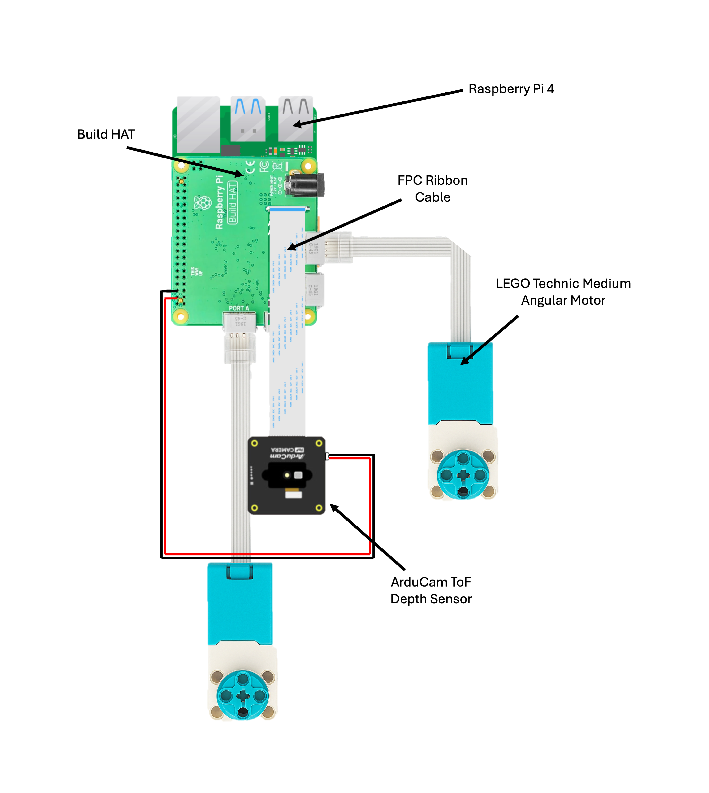

# Actuators Pi Setup Guide

This guide walks you through setting up the Raspberry Pi used for the Actuators and ToF sensor in the
Everything Is Awesome robot system. The setup includes flashing the OS, creating a Python virtual
environment, and running the server scripts.

Assemble the Actuator-Pi hardware as shown in the figure below:



## OS Flashing

To begin, you'll need to install Raspberry Pi OS on your Raspberry Pi 5, which will host the ToF sensor and
interface with the Build HAT.

#### The Raspberry Pi Imager

1) Visit the official Raspberry Pi OS software page: https://www.raspberrypi.com/software/
2) Download and install the Raspberry Pi Imager for your operating system.
3) Launch the Imager and follow these steps:

* Choose OS: Select Raspberry Pi OS (64-bit) under the “Raspberry Pi OS (other)” section.
* Choose Storage: Select your inserted microSD card.
* (Optional but recommended) Click the ⚙️ Advanced options to:
    * Set hostname
    * Enable SSH
    * Preconfigure Wi-Fi
    * Set username and password
4) Click Write and wait for the flashing process to complete.
5) Safely eject the card, insert it into the Raspberry Pi, and boot it up.

> [!NOTE]
> Alternatively, you can use the `dd` command to flash the OS image on the SD Card
> `sudo dd if=IMG_NAME.img of=/dev/sdX bs=4M conf=fsync status=progress`


## Python Virtual Environment Setup

After booting into Raspberry Pi OS and connecting to the network, you’ll need to set up a Python
environment.

Step 1: SSH into the Actuator Pi

```bash
ssh <username>@<actuator-pi-ip>
```

Step 2: Install Python Dependencies

Ensure that some recommended packages are installed:

```bash
sudo apt update
sudo apt install -y python3 python3-venv python3-pip curl vim tmux git
```

Step 3: Create and Activate the Virtual Environment

We use the `--system-site-packages` flag to inherit some pre-installed packages that already
exists in the Raspberry Pi OS image.

```bash
mkdir ~/server
cd ~/server
python 3 -m venv --system-site-packages env
source env/bin/activate
```

Your prompt should now show `(env)` indicating the environment is active

Step 4: Install Required Python Packages

```bash
pip install opencv-python pyro5 buildhat
```

This installs OpenCV for image manipulation, Pyro5 for data transfer over the network,
and buildhat for controlling the LEGO motors.

> [!TIP]
> If you’re working in a headless (no GUI) environment, consider using `opencv-python-headless`
> instead of opencv-python to avoid unnecessary dependencies

Step 5: Follow ArduCam [Instructions](https://www.arducam.com/docs/tof-camera-getting-started/Example/quick_start.html#python) to install ToF packages


## Server Script Setup

To run the actuator servers, you'll need to fetch and configure three Python
scripts: `server_depth.py`, `server_motor.py` and `pyro_utils.py`.

These scripts are located in the `everything_is_awesome/scripts/servers/actuators` folder of the repository.

Step 1: Download the scripts on the actuator-pi

```bash
cd ~/server
curl -O https://raw.githubusercontent.com/thousandbrainsproject/everything_is_awesome/refs/heads/main/scripts/servers/actuators/server_depth.py
curl -O https://raw.githubusercontent.com/thousandbrainsproject/everything_is_awesome/refs/heads/main/scripts/servers/actuators/server_motor.py
curl -O https://raw.githubusercontent.com/thousandbrainsproject/everything_is_awesome/refs/heads/main/scripts/servers/actuators/pyro_utils.py
```

Step 2: Modify the IP Address

Open `server_depth.py` in a text editor and update the line that specifies the host IP address to the static
IP address of this Actuator Pi (e.g. 192.168.0.101):

```python
# server_depth.py

if __name__ == "__main__":
    daemon = Pyro5.api.Daemon(host="IP-ADDRESS", port=3513)
    PatchCameraServer(daemon=daemon, object_id="depth").run()
```

**Do the same for the `server_motor.py` script.**

Step 3: Start the Server in a `tmux` Session

```bash
tmux new -s server-depth
cd ~/server
source env/bin/activate
python server_depth.py
```

Press `Ctrl+B`, then `D` to detach from the session. You can later resume with `tmux attach -t server-depth`

**Repeat the process to start the `server_motor.py` script.**

> [!TIP]
> You can start both servers in the same tmux session using a different pane/window.


## Client-Side Test (Monty Laptop)

To verify that the Actuator Pi server is working correctly and reachable over the network, you can run a simple client script on the Monty laptop.

Step 1: Activate the `tbp_monty` conda environment for the `everything_is_awesome` repository.

The client script depends on pyro5 and opencv-python, which should be available in the conda environment.

```bash
conda activate tbp_monty
```

Step 2: Run the Client Script

Navigate to the project root then to the client script

```bash
cd scripts/client
```

Modify the IP address to the `actuator-pi` IP

```python
# client_depth.py

if __name__ == "__main__":
    pv = PatchViewerClient(server_uri="PYRO:rgb@IP-ADDRESS:3512")
    pv.run()
```

Run the client Script and you should see the RGB image returned by the raspberry Pi Camera

```bash
python client_depth.py
```

**Repeat the steps for the `client_motor.py` script to test motor functionality**


